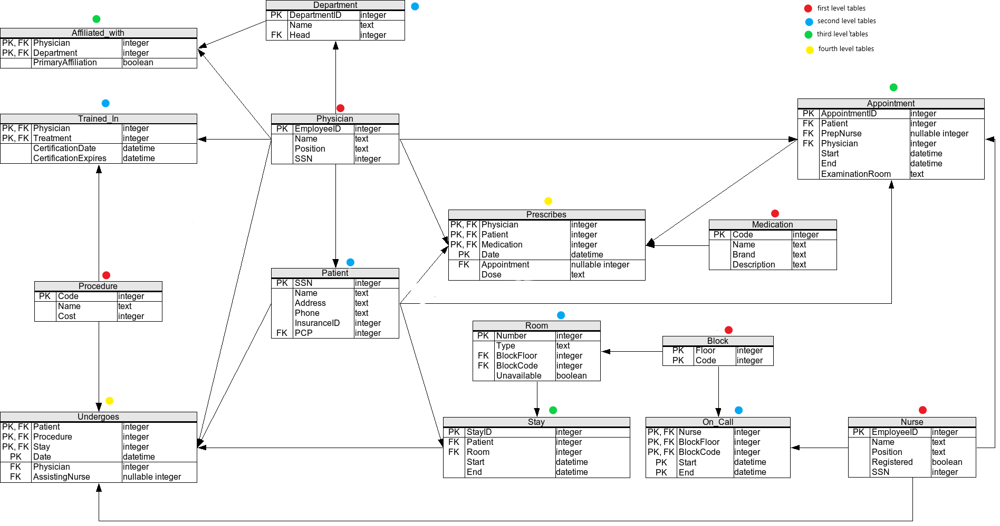

<h2>AIM:</h2>
The aim of this database is practice only. 

<h2>PREREQUISITES:</h2>
You need a MySQL database server (5.0+) and run the commands below through a user that has the following privileges:

SELECT, INSERT, UPDATE, DELETE,  
CREATE, DROP, RELOAD, REFERENCES,  
INDEX, ALTER, SHOW DATABASES,  
CREATE TEMPORARY TABLES,  
LOCK TABLES, EXECUTE, CREATE VIEW 

<h2>INSTALLATION: </h2>
You can find the database installation in MySQL folder.  
Installer name: Windows (x86, 32-bit), MSI Installer  
Installed from: https://dev.mysql.com/downloads/installer/

<h2>DISCLAIMER: </h2>
To the best of my knowledge, this data is fabricated and it does not correspond to real people. Any similarity to existing people is purely coincidental.

<h2>ACCESS: </h2>
This is a test database that can be freely accessed by following the below steps. 

<h2>SCHEMA:</h2>
There is a schema in the directory 'schema.png' which was followed for this mySQL practice. 

<h2>ACCESSING:</h2>
1. Open "MySQL -> MySQL 5.7 Command Line Client"  
2. Enter password: 'password'  
3. Write: 'show databases'  
You should see this:   
+--------------------+ 
| Database           | 
+--------------------+ 
| information_schema | 
| exercise           | 
| giraffe            | 
| mysql              | 
| performance_schema | 
| sys                | 
+--------------------+ 
4. Write: 'use database exercise'.
